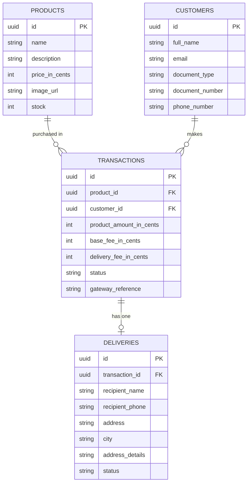

# checkout-flow-api

Backend for a single-product checkout SPA, integrated with [Wompi](https://wompi.co) (Sandbox) for card payments. Built with NestJS, TypeScript, PostgreSQL and TypeORM, following Hexagonal Architecture (Ports & Adapters) and Railway Oriented Programming.

Frontend repo: [checkout-flow-web](https://github.com/yesid1010/checkout-flow-web)

## Live deploy

- API: https://checkout-flow-api-production.up.railway.app
- Swagger docs: https://checkout-flow-api-production.up.railway.app/api

## Business flow

1. **Product page** — description, price, available stock, "Pagar con tarjeta" button.
2. **Card + delivery modal** — customer, card (tokenized directly against Wompi with the public key), and delivery data.
3. **Summary** — product amount + base fee + delivery fee = total, confirm payment.
4. **Status** — final transaction result (approved / declined / error).
5. Back to product, with stock already updated.

## Architecture

Hexagonal Architecture per bounded context (`products`, `customers`, `deliveries`, `transactions`):

```
src/contexts/<context>/
├── domain/            entities, value objects, repository ports (no framework imports)
├── application/       use cases, orchestrating ports via Result (ROP)
└── infrastructure/
    ├── persistence/   TypeORM adapters implementing the repository ports
    ├── http/          controllers + DTOs
    └── gateway/        (transactions only) Wompi adapter
```

- **Ports & Adapters**: `domain/*.repository.ts` are plain interfaces; `infrastructure/persistence/*.typeorm.repository.ts` are the only files that know about TypeORM/Postgres.
- **ROP**: `shared/domain/result.ts` — every use case returns `Result<T, E>` instead of throwing for expected business failures (out of stock, gateway declined, invalid data).
- **Concurrency control**: stock is reserved via a single atomic `UPDATE ... WHERE stock >= quantity` **before** charging, so two buyers racing for the last unit can't both succeed, and a failed/declined payment restores the reserved unit.
- **Payment security**: the integrity signature and the private/integrity Wompi keys never leave the backend. The frontend tokenizes cards directly against Wompi with the **public** key only; this API never receives a raw card number.

## Data model



`Transaction.status`: `PENDING → APPROVED | DECLINED | ERROR` (immutable transitions, enforced in the domain entity).

## Getting started

```bash
cp .env.example .env   # fill in DB_* and WOMPI_* (see below)
npm install
npm run seed:products   # seeds 4 dummy products (no create endpoint exists on purpose)
npm run start:dev
```

The API listens on `http://localhost:3000` (configurable via `PORT`).

### Environment variables

See [.env.example](.env.example). `WOMPI_PUBLIC_KEY`/`WOMPI_PRIVATE_KEY`/`WOMPI_EVENTS_KEY`/`WOMPI_INTEGRITY_KEY` are the Sandbox keys from Wompi's UAT environment. `FRONTEND_URL` scopes CORS to the deployed/local frontend origin.

## API docs

Interactive Swagger UI (schemas auto-generated from the existing DTOs via the `@nestjs/swagger` CLI plugin — no manual annotations):

```
GET /api
```

Locally: http://localhost:3000/api

## Testing

```bash
npm test          # unit tests
npm run test:cov  # unit tests + coverage report
npm run test:e2e  # e2e (needs a running Postgres)
```

Coverage threshold enforced in `package.json` (`jest.coverageThreshold`): **80%** on branches/functions/lines/statements.

Current results:

| Metric | % |
|---|---|
| Statements | 83.1% |
| Branches | 88.1% |
| Functions | 94.1% |
| Lines | 83.6% |

Domain, application (use cases), and infrastructure adapters are all at or near 100%; the aggregate is pulled down only by framework wiring files (`*.module.ts`, `main.ts`, `data-source.ts`, the seed script runner) that are not business logic.

## Wompi Sandbox test cards

For a `POST /transactions` request, `cardToken` must come from tokenizing a card directly against Wompi's sandbox (`POST https://api-sandbox.co.uat.wompi.dev/v1/tokens/cards`) with the **public** key — this API never receives a raw card number. Test card numbers (any future expiry, any 3-digit CVC):

| Card | Result |
|---|---|
| `4242 4242 4242 4242` | APPROVED |
| `4111 1111 1111 1111` | DECLINED |
| Any other card | ERROR |

## Tech stack

NestJS · TypeScript · PostgreSQL · TypeORM · Jest · class-validator · Wompi (Sandbox) · Helmet
